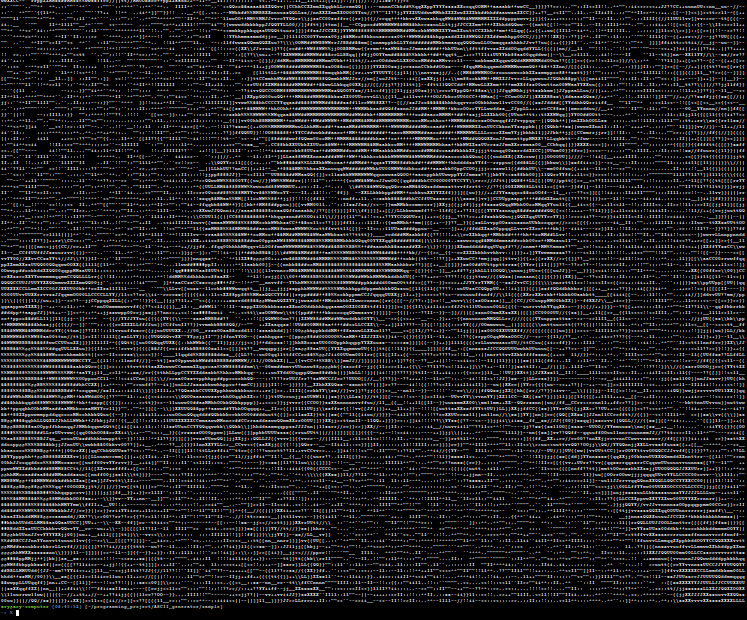

# ASCII Generator
ASCII Generator is a small project used to generate ASCII from an image using a command line interface. It was developed using Python with the help of the Python Image Module (PIL) Library.

### format   
```python3 main.py [image name] [ratio]```  
ratio means x times the size of the original image  
1 means all of the pixels from the original image, while 0.5 means half of the pixels.  
You can use this to adjust to your terminal, so it will fit the screen perfectly.   
### example  
```python3 main.py monalisa.jpg 0.3```


